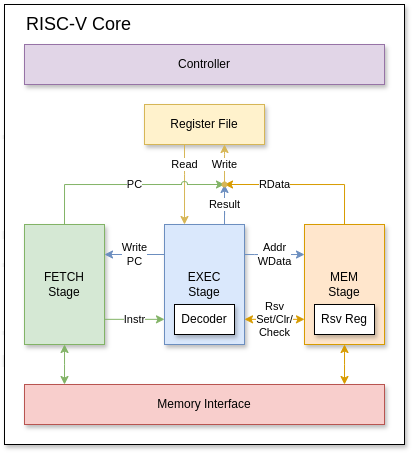

# RISC-V Core

## Architecture
The RISC-V core consists of 3 stages:
- `FETCH`: manages the PC and fetches instructions from memory.
- `EXEC`: decodes and executes the instructions (partially for `LOAD` and `STORE`).
- `MEM`: read and write data from/to memory (for `LOAD` and `STORE`).

These 3 stages are executed in series without pipelining.
The Controller handles the switching of the 3 stages.

The `FETCH` and `MEM` stages have access to the Memory Interface for their functions.
Only the `EXEC` stage can read the Register File and update the CSR,
but the data from all 3 stages can be written back to the Register File, selected using the Write-back Mux.

All exceptions are collected by the Trap Handler, which notifies the CSR and the Controller when an exception happens.

## Block Functions
### Controller
The Controller is a state machine that gives control to each of the 3 stages in the correct order: `FETCH`, `EXEC`, `MEM`.

The `MEM` stage is not needed if the instruction is not a `MemOp` (memory operation, i.e. a `LOAD` or a `STORE`).
This condition is conveyed by the `EXEC` stage during its turn.

The Controller also controls when the Register File and the CSR are written.

`AMO` instructions needs two `EXEC` and `MEM` phases.
In such case, the Controller walks through the states: `FETCH`, `EXEC-0`, `MEM-0`, `EXEC-1`, `MEM-1`.
The phase information is also passes to the `EXEC` stage.

When a synchronous trap (an exception) happens, the Controller gets back to the `FETCH` stage and disable all writes to
the Register File and the CSR, except for changes to handle the trap (setting privilege mode, updating `mcause`, `mepc`, etc.).

### `FETCH` Stage
The `FETCH` stage holds the Program Counter (PC).
At its turn, it sends a request to the Memory Interface to fetch a new instruction.
Once the instruction has been fetched, it adds 4 to the PC and yields control to the `EXEC` stage.

The `FETCH` stage shall update its PC if there is a request from the `EXEC` stage in case of the `JUMP` and `BRANCH` commands.

The `FETCH` stage outputs its PC to be written back to the Register File for the `JAL` and `JALR` commands.

When an exception happens, the PC will be updated to the one provided by the CSR (highest priority) to service the trap.

### `EXEC` Stage
The `EXEC` stage decodes the instructions using the [Decoder](#decoder), accesses the Register File to obtain the operand values,
and executes the instructions using one of its compute engine: `ALU`, `MUL` (multiplier), or `DIV` (divider).
It accomplishes all of its tasks in only 1 cycle (ignore reality for now).

If a command is neither `LOAD` nor `STORE`, the `EXEC` stage passes the control back to the `FETCH` stage to start a new command.
Otherwise, the `EXEC` stage proceeds to the `MEM` stage to complete the memory operation.

The `EXEC` stage may write a new PC to the `FETCH` stage in case of the `JUMP` and `BRANCH` commands.

The `EXEC` stage is also in charge of selecting the input of the Write-back Mux.
However, when to update the Register File is decided by the Controller.

The `EXEC` needs to store the last `MEM` address, so it can be reused in phase 2 of the `AMO` instructions.

### `MEM` Stage
The `MEM` stage sends a request to the Memory Interface to complete memory operations.
The `MEM` stage is not always executed, only during `LOAD` and `STORE` operations.

The address is provided by the `EXEC` stage.
In case of a `STORE`, the `WData` is also given by the `EXEC` stage.
In case of a `LOAD`, the `RData` is written back to the Register File.

The `MEM` stage also handles bit-extension for byte and half-word accesses.

The `MEM` stage contains a reservation register for LR/SC commands.
This register stores the most recent LR address,
which is invalidated if the `MEM` stage encounters any store with the same address or an `SC` instruction.
This register is exposed to the `EXEC` stage via a set/check/clear interface.
The size of the reservation set is 4 bytes.

The `MEM` needs to store the last read data, so it can be reused in phase 2 of the `AMO` instructions.

Misaligned access is not allowed and will raise an exception.

### Register File
The Register File is an array of 32 architectural registers, with 2 read ports and 1 write port.
The read ports are combinational and are accessed only by the `EXEC` stage.
The write ports are controlled by the Controller, which is enabled either at the `EXEC` stage
or at the end of `MEM` stage depending on the commands.

When an exception happens, the Register file will be disabled by the Controller.

### Control and Status Register (CSR)
The CSR contains all the registers needed to support privilege modes. Currently, only M-mode and U-mode are supported.
It manages the privilege mode, general status `mstatus`, settings to service traps (`mtvec`, `mie`, `mip`, `mcause`, `mtval`, `mepc`),
and counters (`mcycle`, `minstret`). It receives controls from the `EXEC` stage to extract and update the values of its registers.

When an exception happens, normal update to the CSR is disabled.
Instead, the CSR receives the trap's data from the Trap handler and modifies the privilege mode and the PC to service the trap.
PC update request from the CSR to the `FETCH` stage has the highest priority.

### Memory Interface
The Memory Interface connects the core to the RAM of the machine via APB bus.
All addresses go in and out of the memory interface must be aligned with the bus (4B-aligned).
For narrow write transfer, write strobes should be used.

### Trap Handler
The Trap handler collects all the exception sources from the other modules, sorts them
based on the priority list defined in the spec, and generates an exception code for `mcause`.
It also collects the corresponding `mtval` to be stored in the CSR.
The Trap handler also signals the Controller besides the CSR.

## Decoder
The Decoder is a subcomponent of the `EXEC` stage. Its job is to decode the instruction fetched from the `FETCH` stage
into the following conditions:
- Immediate type: `Z` (Zero), `I`, `S`, `B`, `U`, `J`, `C` (`uimm` in CSR ops).
- EXEC sources: `RR` (Reg + Reg), `RI` (Reg + Imm), `MR` (Mem + Reg), `PI` (PC + Imm), `ZI` (Zero + Imm), `CA` (CSR + `rs1`), `CI` (CSR + Imm).
- ALU operation: `ADD`, `SUB`, `SLT`, `SLTU`, `AND`, `OR`, `XOR`, `ANDN` (and-not), `ORN` (or-not), `XNOR`, `SLL`, `SRL`, `SRA`, `MIN`, `MAX`, `MINU`, `MAXU`,
`OA` (output `rs1`), `OB` (output `rs2`).
- MUL operation: `MUL`, `MULH`, `MULHSU`, `MULHU`.
- DIV operation: `DIV`, `DIVU`, `REM`, `REMU`.
- EXEC output: `ALU`, `MUL`, `DIV`, `RSV` (reservation), `CSR`.
- Write-back source: `NONE`, `FETCH` (PC + 4), `EXEC`, `MEM`.
- PC source: `NONE`, `JUMP`, `BR_Z` (branch on zero), `BR_NZ` (branch on non-zero).
- Mem sources: `ALU_B` (addr from ALU, data from `rs2`), `LAST_ALU` (addr from last, data from ALU).
- Mem operation: `NONE`, `READ`, `WRITE`.
- Mem access size: `B`, `BU`, `H`, `HU`, `W`.
- Reservation: `NONE`, `RSV_SET`, `RSV_CLEAR`.

### Decoding table

| Op       | Imm type | ALU src | Engine op                   | WB src  | PC src  | Mem op                              | Mem src - size     |
|----------|----------|---------|-----------------------------|---------|---------|-------------------------------------|--------------------|
| `OP`     |          | `RR`    | `{funct7[5], funct3}`       | `ALU`   |         |                                     |                    |
| `OP-IMM` | `I`      | `RI`    | `funct3` (except for `SRA`) | `ALU`   |         |                                     |                    |
| `LUI`    | `U`      | `ZI`    | `ADD`                       | `ALU`   |         |                                     |                    |
| `AUIPC`  | `U`      | `PI`    | `ADD`                       | `ALU`   |         |                                     |                    |
| `JAL`    | `J`      | `PI`    | `ADD`                       | `FETCH` | `JUMP`  |                                     |                    |
| `JALR`   | `I`      | `RI`    | `ADD`                       | `FETCH` | `JUMP`  |                                     |                    |
| `BEQ`    | `B`      | `RR`    | `SUB`                       |         | `BR_Z`  |                                     |                    |
| `BNE`    | `B`      | `RR`    | `SUB`                       |         | `BR_NZ` |                                     |                    |
| `BLT`    | `B`      | `RR`    | `SLT`                       |         | `BR_NZ` |                                     |                    |
| `BGE`    | `B`      | `RR`    | `SLT`                       |         | `BR_Z`  |                                     |                    |
| `BLTU`   | `B`      | `RR`    | `SLTU`                      |         | `BR_NZ` |                                     |                    |
| `BGEU`   | `B`      | `RR`    | `SLTU`                      |         | `BR_Z`  |                                     |                    |
| `LOAD`   | `I`      | `RI`    | `ADD`                       | `MEM`   |         | `READ`                              | `ALU_B` - `funct3` |
| `STORE`  | `S`      | `RI`    | `ADD`                       |         |         | `WRITE`                             | `ALU_B` - `funct3` |
| `MUL`    |          | `RR`    | `funct3[1:0]`               | `MUL`   |         |                                     |                    |
| `DIV`    |          | `RR`    | `funct3[1:0]`               | `DIV`   |         |                                     |                    |
| `LR`     | `Z`      | `RI`    | `ADD`                       | `MEM`   |         | `READ` - `RSV_SET`                  | `ALU_B` - `W`      |
| `SC`     | `Z`      | `RI`    | `ADD`                       | `RSV`   |         | `WRITE` if rsv. valid - `RSV_CLEAR` | `ALU_B` - `W`      |
| `AMO-0`  | `Z`      | `RI`    | `ADD`                       | `MEM`   |         | `READ`                              | `ALU_B` - `W`      |
| `AMO-1`  |          | `MR`    | Decode from `funct5`        |         |         | `WRITE`                             | `LAST_ALU` - `W`   |
| `CSR`    |          | `CA`    | `OB`, `OR`, or `ANDN`       | `CSR`   |         |                                     |                    |
| `CSRI`   | `C`      | `CI`    | `OB`, `OR`, or `ANDN`       | `CSR`   |         |                                     |                    |

Empty entries are either `NONE` or N/A (e.g. immediate type is not relevant to R-type operations).
`AMO` instructions has two `EXEC` and `MEM` phases, hence `AMO-0` and `AMO-1`.
