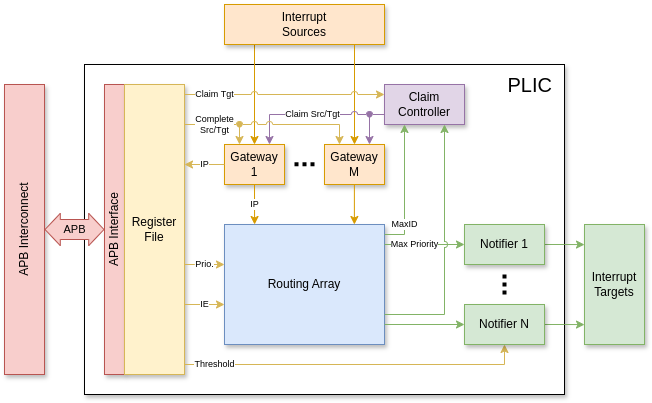

# Platform Level Interrupt Controller (PLIC)
The PLIC module gathers all the interrupt sources of the platform
and forward them to the RISC-V core via its external interrupt pins.
The register map complies with the RISC-V PLIC specification.
The design is parameterized and can support up to 31 interrupt sources and 32 targets.

Only level interrupt is supported. Pulse interrupt is not supported.

## Architecture
The main parts of the PLIC module are:
- Gateways to control the interrupt sources.
- Notifier to notify the interrupt targets.
- Routing array that connects the gateways and the notifiers.
- Claim controller to provide claim source lookup.
- Register file to store the configurations with an APB interface to connect to the bus.

## Block Functions
### Gateway
The Gateway keeps track the claimed/completed state of the source to gate the interrupt inputs.
If the interrupt has been claimed, the Gateway masks its input until the interrupt is completed.
The completion must have the same target ID as the one provided in the claim.
Otherwise, the completion is silently ignored.

The output of the Gateway is the Interrupt Pending signal for the Routing array and the Register file.

### Routing Array
The Routing array processes:
- The Interrupt Pending signals from the Gateways;
- The Interrupt Priority and Interrupt Enable from the Register file.

It then finds the maximum interrupt priority and the corresponding source ID for each target.
This information is used by the Notifiers and the Claim controller.

### Notifier
The Notifier compares the maximum interrupt priority and the Priority Threshold of each target.
If the maximum priority is strictly larger than the threshold, then the corresponding interrupt line is asserted
to notify the target.

### Claim Controller
Once a claim request is received, the Claim controller
decodes the target ID to find the source ID corresponding to the interrupt of maximum priority routed to that target.
The Claim controller then routes that information to the Gateways to perform a claim.

### Register File
The Register file stores all the configurations of the module. The configurations include:
- Interrupt Priority
- Interrupt Enable
- Priority Threshold

The Register file also exposes the Interrupt Pending status and the Claim/Complete interface from the Gateways.

### APB Interface
The APB interface exposes the Register file to the outside via the APB bus. The bus is 32-bit wide.
Accesses must be 4-byte aligned. Otherwise, an error will be returned via `PSLVERR`.

## Register Map
The memory space reserved for PLIC register is 64MB (26 bits).

| Offset                   | Register Name                     | Permissions | Reset value  |
|--------------------------|-----------------------------------|-------------|--------------|
| `0x0000000 + 4 * i`      | Interrupt Priority of source `i`  | RW          | `0x00000000` |
| `0x0001000`              | Interrupt Pending                 | R           | `0x00000000` |
| `0x0002000 + 0x80 * j`   | Interrupt Enable for target `j`   | RW          | `0x00000000` |
| `0x0200000 + 0x1000 * j` | Priority Threshold for target `j` | RW          | `0x00000000` |
| `0x0200004 + 0x1000 * j` | Claim for target `j`              | R           | `0x00000000` |
| `0x0200004 + 0x1000 * j` | Complete for target `j`           | W           |              |
