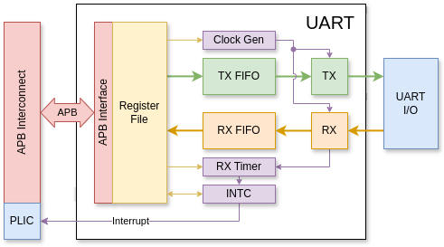

# UART Module
The UART module provides communication to the outside using the UART protocol.
It is connected to the RISC-V core via the APB bus.
The register map is compatible with the NS16550 IC.

## Architecture
The main parts of the UART module are:
- Transmitter (TX) and Receiver (TX) with their respective FIFOs to decode UART signals,
- Control and Status Register (CSR) to store the configurations,
- APB interface to connect with the bus.

The UART module also includes an INTC to control the interrupt, and a clock generator
to provide clock scaling for the TX and RX.



## Block Functions
### Transmitter (TX)
The Transmitter receives a request to transfer a byte from the TX FIFO and converts it to
IO signals to control the UART TX pin. A byte is transmitted within a frame consisting of:
- 1 start bit (always 0),
- 5-8 bits data (least-significant bit first),
- 1 optional parity bit,
- 1-2 stop bits (always 1).

The default state of the TX pin is 1. The length of a bit is 16 times scaled cycles,
which is provided by the Clock generator.

### Receiver (RX)
The Receiver listens to the IO signals from the UART RX pin and assembles back into bytes of data.
First, the RX looks for a falling edge, signaling a start bit.
It then waits for 8 times scaled cycles and resamples the RX pin again for a zero to confirm that this is a real start bit.
Once the start bit has been identified, it samples the data bits, parity bit, and stop bit every 16 times scaled cycles.
Once a frame is done receiving, it pushes all data and errors to the RX FIFO.

The scaled clock is provided by the Clock generator.

### TX and RX FIFO
TX and RX FIFO are buffers that can store up to 16 data frames. They can be bypassed if the FIFO feature is disabled in the CSR.

### Control and Status Register (CSR)
The CSR store all the configurations of the module. The configurations include:
- Interrupt enable (`IER`): Data ready, THR ready, RX line status, Modem status;
- FIFO control (`FCR`): FIFO enable, RX FIFO trigger level;
- Line control (`LCR`): Word length, Stop bit, Parity enable, Even parity, Force parity, Set break, DLAB;
- Modem control (`MCR`): DTR, RTS, Out 1/2, Look back;
- Divisor constant (`DLL/M`)

Status is collected from other modules. Modem control and status are not supported
(content of `MCR` is ignored, `MSR` always returns zero).

### APB Interface
The APB interface exposes the CSR and the FIFOs to the outside via the APB bus. The bus is 32-bit wide.
However, one register in the NS16550 is 1-byte long, and register reads have side effects.
Thus, unstandard APB is used to support unaligned access.
The APB interface will accept `PADDR` and output only that exact byte at the correct byte lane, which is similar to the AXI protocol.
For write transfer, `PSTRB` must only cover 1 byte, which is the same byte indicated by `PADDR`.
Invalid `PSTRB` will result in an error, reported via `PSLVERR`.

RISC-V core is expected to access the UART memory space using only `LB`, `LBU`, or `SB` commands.

### Clock Generator
The Clock generator produces a pulse periodically for the TX and RX.
The period of the pulse is determined by the divisor constant in the CSR.
A bit on the UART I/O lasts for 16 such pulses.
This means the baud rate is calculated as:
```
baud_rate = clock_freq / (16 * div_const)
```

### Interrupt Controller (INTC)
The INTC gathers the interrupt sources and controls the interrupt pin.
It also provides the interrupt code for the Interrupt status register (`ISR`)
based on the interrupt priority.

### RX Timer
This timer starts counting when the RX FIFO is non-empty and resets whenever
`RHR` is read or a new byte has been received. Once a time corresponding to 4 frames has passed,
a timeout interrupt is emitted.

If the RX FIFO is not enabled, the timer is disabled.

## Register Map
| Offset         | Register Name              | 7                 | 6                 | 5                | 4                 | 3                 | 2                 | 1                 | 0                 |
|----------------|----------------------------|-------------------|-------------------|------------------|-------------------|-------------------|-------------------|-------------------|-------------------|
| `R-0`          | RX Holding (`RHR`)         | RX 7              | RX 6              | RX 5             | RX 4              | RX 3              | RX 2              | RX 1              | RX 0              |
| `W-0`          | TX Holding (`THR`)         | TX 7              | TX 6              | TX 5             | TX 4              | TX 3              | TX 2              | TX 1              | TX 0              |
| `RW-1`         | Interrupt Enable (`IER`)   | 0                 | 0                 | 0                | 0                 | Modem status      | RX line status    | THR status        | Data ready        |
| `R-2`          | Interrupt Status (`ISR`)   | FIFO enable       | FIFO enable       | 0                | 0                 | Int code 2        | Int code 1        | Int code 0        | Int status        |
| `W-2`          | FIFO Control (`FCR`)       | Trigger level 1   | Trigger level 0   | 0                | 0                 | 0                 | TX reset          | RX reset          | FIFO enable       |
| `RW-3`         | Line Control (`LCR`)       | DLBA              | Set break         | Force parity     | Even parity       | Parity enable     | Stop bits         | Word length 1     | Word length 0     |
| `RW-4`         | Modem Control (`MCR`)      | 0                 | 0                 | 0                | Loop back         | Out 2             | Out 1             | RTS               | DTR               |
| `R-5`          | Line Status (`LSR`)        | FIFO error        | TX empty          | THR empty        | Break interrupt   | Frame error       | Parity error      | Overrun error     | Data ready        |
| `R-6`          | Modem Status (`MSR`)       | 0                 | 0                 | 0                | 0                 | 0                 | 0                 | 0                 | 0                 |
| `RW-7`         | Scratch Pad (`SPR`)        |                   |                   |                  |                   |                   |                   |                   |                   |
| `RW-0` `(DLAB)`| Divisor Latch LSB (`DLL`)  |                   |                   |                  |                   |                   |                   |                   |                   |
| `RW-1` `(DLAB)`| Divisor Latch MSB (`DLM`)  |                   |                   |                  |                   |                   |                   |                   |                   |
